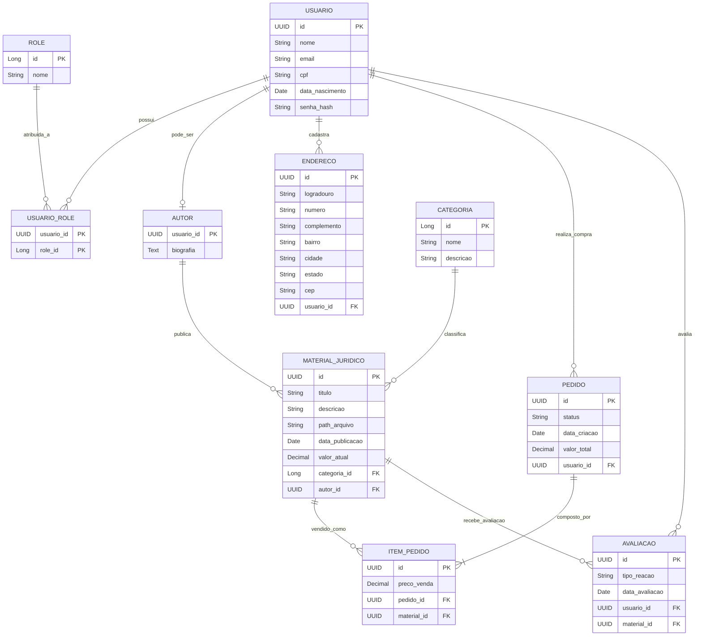

```mermaid
erDiagram
    USUARIO {
        UUID id PK
        String nome
        String email
        String cpf
        Date data_nascimento
        String senha_hash
    }
    
    ENDERECO {
        UUID id PK
        String logradouro
        String numero
        String complemento
        String bairro
        String cidade
        String estado
        String cep
        UUID usuario_id FK
    }
    
    ROLE {
        Long id PK
        String nome
    }
    
    USUARIO_ROLE {
        UUID usuario_id PK
        Long role_id PK
    }
    
    AUTOR {
        UUID usuario_id PK
        Text biografia
    }
    
    CATEGORIA {
        Long id PK
        String nome
        String descricao
    }
    
    MATERIAL_JURIDICO {
        UUID id PK
        String titulo
        String descricao
        String path_arquivo
        Date data_publicacao
        Decimal valor_atual
        Long categoria_id FK
        UUID autor_id FK
    }
    
    PEDIDO {
        UUID id PK
        String status
        Date data_criacao
        Decimal valor_total
        UUID usuario_id FK
    }
    
    ITEM_PEDIDO {
        UUID id PK
        Decimal preco_venda
        UUID pedido_id FK
        UUID material_id FK
    }
    
    AVALIACAO {
        UUID id PK
        String tipo_reacao
        Date data_avaliacao
        UUID usuario_id FK
        UUID material_id FK
    }

    %% Relacionamentos
    USUARIO ||--o{ USUARIO_ROLE : "possui"
    ROLE ||--o{ USUARIO_ROLE : "atribuida_a"
    USUARIO ||--o| AUTOR : "pode_ser"
    USUARIO ||--o{ ENDERECO : "cadastra"
    
    AUTOR ||--o{ MATERIAL_JURIDICO : "publica"
    CATEGORIA ||--o{ MATERIAL_JURIDICO : "classifica"
    
    USUARIO ||--o{ PEDIDO : "realiza_compra"
    PEDIDO ||--|{ ITEM_PEDIDO : "composto_por"
    MATERIAL_JURIDICO ||--o{ ITEM_PEDIDO : "vendido_como"
    
    USUARIO ||--o{ AVALIACAO : "avalia"
    MATERIAL_JURIDICO ||--o{ AVALIACAO : "recebe_avaliacao"
```
